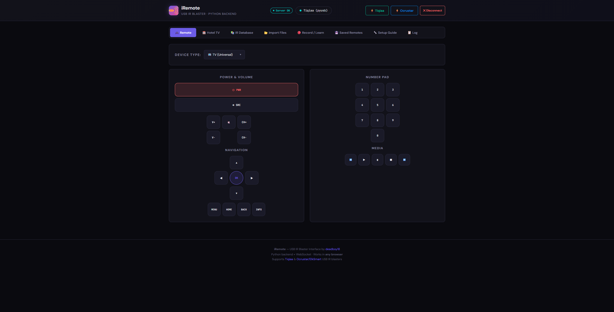
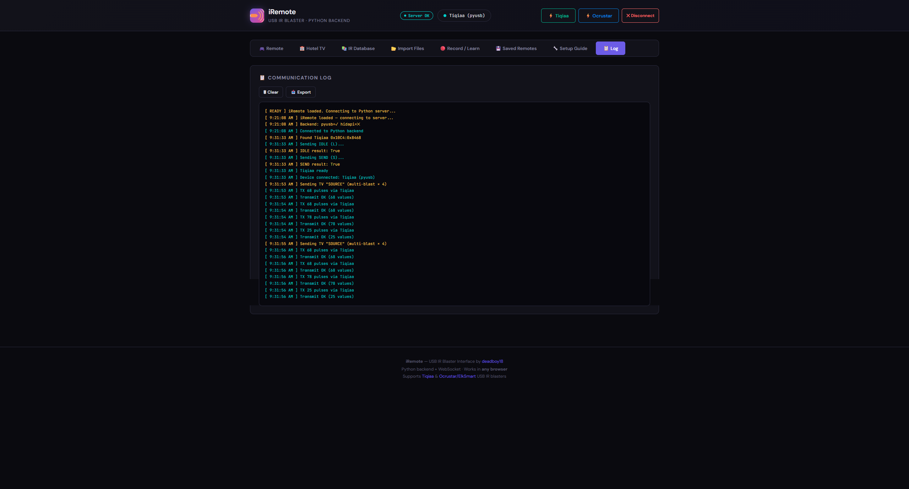

<p align="center">
  
</p>

<h1 align="center">iRemote</h1>
<p align="center">
  <strong>Universal USB IR Blaster — Web Interface</strong><br>
  Control any TV, AC, fan, or IR device from your browser.
</p>

<p align="center">
  <a href="#features">Features</a> •
  <a href="#supported-devices">Devices</a> •
  <a href="#quick-start">Quick Start</a> •
  <a href="#screenshots">Screenshots</a> •
  <a href="#how-it-works">How It Works</a> •
  <a href="#credits">Credits</a>
</p>

<p align="center">
  
  
  
  
</p>

---

## What is this?

**iRemote** is a web-based universal IR blaster interface powered by a Python backend. Plug in a USB IR blaster, run the server, and control any infrared device from any browser — no WebUSB or special browser extensions required.

Works with cheap USB IR blasters you can find on AliExpress for $3–8:
- **Tiqiaa** (uses the ZaZa Remote app on mobile)
- **Ocrustar / ElkSmart** (uses the Smart IR Blaster app on mobile)

## Features

| Feature | Description |
|---------|-------------|
| 🎮 **Universal Remote** | TV remote with multi-blast (Samsung + LG + Sony + Philips simultaneously) |
| 🏨 **Hotel TV Toolkit** | Pre-built macros for hotel/hospitality TV menus — Samsung, LG, Sony, Philips |
| 📚 **IR Database Browser** | Browse 300,000+ IR codes from [Flipper-IRDB](https://github.com/Lucaslhm/Flipper-IRDB) and [irdb](https://github.com/probonopd/irdb) |
| 📂 **File Import** | Flipper Zero `.ir`, IRDB `.csv`, Pronto hex, raw pulse data, iRemote Android `.json` |
| 🔴 **IR Learning** | Capture signals from physical remotes (point and press) |
| ⚡ **Batch Learn** | Pre-define button names, learn them one-by-one — fast full remote capture |
| ❄️ **AC / Fan Remotes** | Temperature control, mode switching, fan speed |
| 📡 **Protocol Sender** | Manual NEC / Samsung32 / RC5 / Sony SIRC with hex address + command |
| 💾 **Saved Remotes** | Persist custom remotes, export/import as JSON |
| 🔧 **Custom Macros** | Build your own IR button sequences with delays |
| 📋 **Full Logging** | See every USB frame, protocol encode, and device response |

## Supported Devices

| Device | VID:PID | Interface | Buy |
|--------|---------|-----------|-----|
| **Tiqiaa** | `10C4:8468` | pyusb (bulk transfers) | [AliExpress](https://www.aliexpress.com/w/wholesale-tiqiaa-ir-blaster.html) ~$5 |
| **Ocrustar / ElkSmart** | `045C:02AA` + 10 others | pyusb (libusb) | [AliExpress](https://www.aliexpress.com/w/wholesale-usb-ir-blaster.html) ~$3 |

Both devices support **transmit and receive** (learn mode).

## Quick Start

```bash
# 1. Clone
git clone https://github.com/deadboy18/iRemote.git
cd iRemote

# 2. Install dependencies
pip install -r requirements.txt

# 3. Run
python server.py

# 4. Open any browser
#    http://localhost:7890
```

### Windows Extra Step

For **Ocrustar**: install [Zadig](https://zadig.akeo.ie/), select your device (`SMART`), and replace the driver with **WinUSB**.

For **Tiqiaa**: also needs WinUSB via Zadig (despite being HID — it uses bulk transfers internally).

### Linux

```bash
# Allow non-root USB access
sudo cp 99-irblaster.rules /etc/udev/rules.d/
sudo udevadm control --reload-rules
```

<details>
<summary>Example udev rules (99-irblaster.rules)</summary>

```
# Tiqiaa
SUBSYSTEM=="usb", ATTR{idVendor}=="10c4", ATTR{idProduct}=="8468", MODE="0666"
# Ocrustar
SUBSYSTEM=="usb", ATTR{idVendor}=="045c", MODE="0666"
```
</details>

## Screenshots

| Remote | Hotel TV | IR Database |
|--------|----------|-------------|
|  |  |  |

| File Import | Learn Mode | Log |
|-------------|------------|-----|
|  |  |  |

## How It Works

```
┌──────────────────┐     WebSocket/Socket.IO     ┌──────────────────┐     USB      ┌──────────┐
│   Browser (any)  │ ◄──────────────────────────► │  Python Server   │ ◄──────────► │ IR Blaster│
│                  │                              │  server.py       │              │          │
│  • UI / Remote   │                              │  • pyusb         │              │  Tiqiaa  │
│  • IR encoders   │                              │  • Pulse compress │              │    or    │
│  • IRDB browser  │                              │  • Huffman encode │              │ Ocrustar │
│  • File import   │                              │  • Learn mode    │              │          │
└──────────────────┘                              └──────────────────┘              └──────────┘
```

**Frontend** (`index.html`): All UI, IR protocol encoders (NEC, Samsung32, Sony SIRC, RC5), file parsers, IRDB GitHub API integration, hotel macros, saved remotes.

**Backend** (`server.py`): USB device management via `pyusb`, Ocrustar protocol engine (pulse compression, Huffman coding, LEB128 with ÷16 prescaling, byte mangling, FC/FA handshake), Tiqiaa HID-over-bulk protocol, learn/capture mode.

### Why a Python backend?

WebUSB and WebHID are Chrome-only and have significant limitations with these devices. The Python backend works with **any browser** (Firefox, Safari, mobile browsers) and gives full control over USB communication, including the complex Ocrustar encoding pipeline.

### GitHub Pages + Local Server

The UI is hosted on [GitHub Pages](https://deadboy18.github.io/iRemote/) so you can use it without downloading anything — just run `python server.py` locally and the hosted page connects to `localhost:7890`. You can also download `index.html` and open it directly as a file.

## Hotel TV Macros

Built-in sequences for accessing hospitality TV service menus:

| Brand | Macros |
|-------|--------|
| **Samsung** | Hotel Menu, Hotel Menu (Alt), Smart Remote Unlock, Service Menu, Factory Service, PIN Reset |
| **LG** | Installer Menu (9876), Installer Menu (1105), Service Menu |
| **Philips** | Hotel Mode (BDS), Service Menu (SAM) |
| **Sony** | Service Menu |
| **Universal** | Power Off All (6 brands at once) |

You can also build and save custom macros with the macro builder.

## File Format Support

| Format | Source | Extension |
|--------|--------|-----------|
| Flipper Zero IR | [Flipper-IRDB](https://github.com/Lucaslhm/Flipper-IRDB) | `.ir` |
| IRDB CSV | [probonopd/irdb](https://github.com/probonopd/irdb) | `.csv` |
| iRemote Android JSON | iRemote Android app | `.json` |
| Pronto Hex | Various | `.txt` |
| Raw Pulse Data | Any | `.txt` |

## Dependencies

```
flask>=3.0
flask-socketio>=5.3
pyusb>=1.2.1
libusb-package>=1.0.26
```

## Project Structure

```
iRemote/
├── index.html          # Frontend — full UI (single file, no build step)
├── server.py           # Python backend — USB communication
├── requirements.txt    # Python dependencies
├── screenshots/        # App screenshots
└── README.md
```

## Related Projects

- [Ocrustar-USB-IR](https://github.com/deadboy18/Ocrustar-USB-IR) — Ocrustar/ElkSmart reverse engineering & driver
- [Tiqiaa-USB-IR-Windows](https://github.com/deadboy18/Tiqiaa-USB-IR-Windows) — Tiqiaa reverse engineering & driver
- [Flipper-IRDB](https://github.com/Lucaslhm/Flipper-IRDB) — Flipper Zero IR database
- [probonopd/irdb](https://github.com/probonopd/irdb) — Community IR database

## License

MIT

---

<p align="center">
  Made by <a href="https://github.com/deadboy18">deadboy18</a><br>
  <sub>Protocol reverse engineering, USB drivers, and web interface</sub>
</p>